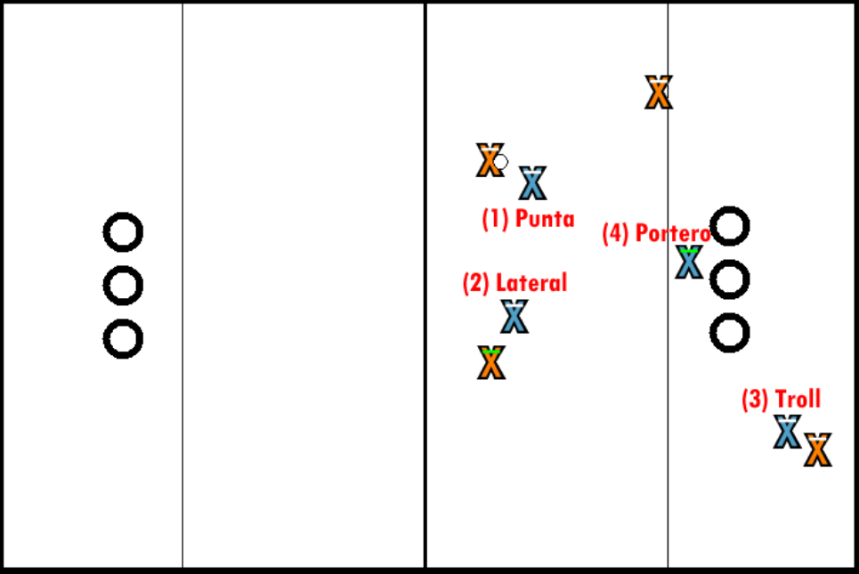
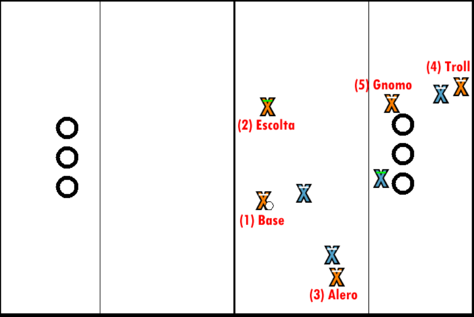

# Roles de Cazador

Hay que tener en cuenta que el keeper es un cazador más, y así se le considerará a menos que se indique lo contrario.

## Defensa

### Roles

- **Punta**

  Defensa individual al base. En caso de doble punta, uno a cada lado del bludger que acompaña al base.

- **Lateral** 

  Defiende el lado fuerte del campo, para que el ataque se decante para un lado. El lado fuerte generalmente es el izquierdo (visto desde defensa), pero puede variar.

- **Defender el Troll** 

  Únicamente lo usaremos en caso que el ataque enemigo use trolls.

- **Portero** 

  Puede ser tanto keeper como chaser. Defiende los aros de los tiros de lejos. En caso que alguien entre cargando debe salir de aros a placar (cual portero de fútbol, pero con placaje). Puede haber más de un portero, en cuyo caso deben organizarse a la hora de situarse en aros (por ejemplo, si uno sale a placar el segundo debe ocupar la posición del primero cubriendo los tiros).

### Organización:

Las defensas de chasers pueden (deben) situarse en una mezcla de defensa individual y zonal, dado que hay 4 chasers defendiendo y 5 objetivos a defender (4 atacantes + aros). Notas:

- El punta siempre defiende individualmente, así como el portero zonalmente.
- El lateral puede defender tanto a un chaser de forma individual como el lateral entero (jugando más reservado).
- El troll generalmente será individual, pero si hay más de 1 troll y solo un defensor defendiéndolos será necesario que la defensa sea zonal.

#### Ejemplos de defensas:

- **Individual/Personal** 

  Caso extremo donde se dejan los aros libres y cada chaser defiende a un chaser enemigo.

- **Zonal** 

  3 porteros y un punta. En caso que el punta sea superado un chaser debe salir de aros a sustituirlo, y el punta va a aros a completar la zonal.

- **Casi personal** 

  Un portero, un punta y dos laterales que defienden individualmente. En caso que haya trolls estos se suponen responsabilidad compartida del portero y el beater defensor.

- **Falso Keeper** 

  Un portero y el resto de jugadores en la línea del área de keeper (generalmente el keeper hace de punta).

## Ataque

### Roles

1- **Base** 

  Sube el balón y organiza el ataque. Requiere buen pase y tiro. Deben analizar el juego y reaccionar correspondientemente, incluyendo evitar ser placado hasta fuera/medio campo.

2- **Escolta** 

  La sombra del base. Debe ser capaz de apoyar al base (realizar un bloc, ir a coger su mano, recibir un pase desesperado, correr a aros en caso que nos hagan un push), ser capaz de penetrar rápida y eficazmente (si por ejemplo el base hace un pase suicida al escolta este debería penetrar rápidamente, como mucho realizar un pase al troll) e incluso sustituir al base a la hora de organizar el juego.

3- **Alero** 

  Generalmente situado en la banda, debe de saber recibir un pase largo y penetrar, ver las oportunidades para realizar un corte o, en caso extremo, subir corriendo a apoyar al base.

4- **Troll** 

  Se sitúa abierto detrás de los aros enemigos para recibir balón y penetrar, o bien para recoger cualquier tiro fallido. Se le realizarán pases cuando se quiera invertir el juego, por lo que debe tener buena recepción y saber penetrar.

5- **Gnomo** 

  Tipo de troll que se sitúa en un aro enemigo (generalmente el pequeño, pero se puede invertir) para recibir y marcar. Actúa como un cuarto aro, aunque tmb puede realizar un bloqueo al portero enemigo.

