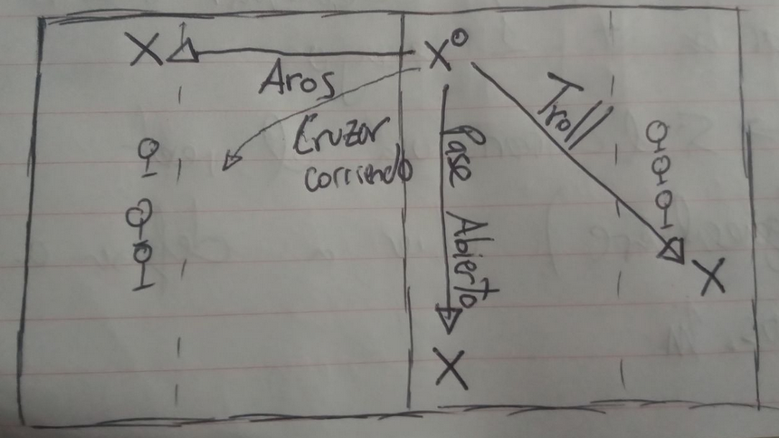

# Presión Defensiva

## ¿Qué es el Push/Presión Defensiva?

Cuando se golpea a todos los Beaters defensores se suele gritar “No Bludger!” y los chasers entrar en línea recta a marcar. Análogamente cuando se golpea a todos los Beaters atacantes se grita “Presión!” y se sube a presionar al ataque. El objetivo es que los Beaters fuercen un pase que los Chasers puedan cortar, o que el Quaffle Carrier sea golpeado. A diferencia del “No Bludger!” ofensivo es esencial que tanto Beaters como Chasers presionen coordinados.

## ¿Cuando se realiza una Presión?

Su uso más general es cuando el equipo atacante ha intentado limpiar a los Beater defensores y han fallado. En estos casos las bludgers se suelen ir bien lejos (dado que al limpiar en ataque se tiran con mayor fuerza que en el caso general) así que da oportunidad a la defensa a recuperar BC si no la tenían y a presionar libres de Beater atacantes durante unos segundos.

[Ejemplo 1](https://www.youtube.com/watch?v=Po71feb9iUM&t=260s)

También es posible forzar un Push desde la defensa mediante una defensa muy agresiva. El caso más típico es una defensa vertical con Bludger Control donde el Beater punta intenta golpear al Beater atacante antes que este tenga oportunidad de hacer nada. Luego puede coger la bludger que el Beater atacante deje dejando así al otro Beater atacante a buscar la bludger que ha rebotado en su compañero (por supuesto muchos otros casos se pueden dar pero, mientras el beater atacante con bludger sea golpeado y el defensor no, generalmente se puede realizar un push).

[Ejemplo 2](https://www.youtube.com/watch?v=Po71feb9iUM&t=320s)

## ¿Como se realiza una Presión?

1. El beater defensor debería gritar Presión. También lo pueden gritar otros jugadores o el banquillo, pero generalmente serán los beaters quienes lo vean primero.
2. Uno (y solo uno generalmente) de los beaters debe correr en línea recta al quaffle carrier. Los chasers deberían transicionar a una defensa 100% personal: es decir ningún chaser atacante debería quedarse libre (por supuesto el portero deberá escoger entre abandonar aros o defender al chaser más cercano). El segundo beater deberá quedarse atrás y cubrir el resto de pases, en especial el más peligroso: El Troll.
3. El beater defensor deberá forzar un pase mediante fintas o matar al quaffle carrier. OJO: Si el chaser atacante realiza un pase suicida efectivo aún pueden salvar el ataque.
4. En caso que se haya conseguido el Turnover generalmente se dará que el equipo antes atacante (ahora defensor) sigue sin bludgers, por lo que los chasers deberán cargar a aros como en cualquier otro “No bludger!” ofensivo.

## ¿Como responder a la Presión?

Las ideas principales de una respuesta efectiva al Push son: jugar abiertos y defensivos, y no tener miedo a usar el reset (en caso que aún esté disponible). El objetivo es esperar a que los beaters de tu equipo remonten/recuperen bludger y puedan venir a protegeros. Alternativamente también se puede intentar aprovechar cualquier error del equipo que hace Push para marcar gol, pero NO se debe contar con que esto sea posible (un PUSH perfecto no debería tener aperturas).

La mejor respuesta a un Push es un pase al troll. Sin embargo dejar al troll desprotegido es un flagrante error de la defensa, por lo que no será el caso típico. Es lo que suele pasar cuando el keeper defensor ha decidido NO salir de sus aros para hacer la 100% personal, y/o si ambos beaters defensores han subido a forzar el pase (Basta con que suba 1 beater!).

[Ejemplo 3](https://www.youtube.com/watch?v=Po71feb9iUM&t=320s)

Pase a aros: La jugada más estable y conservadora, aunque requiere tener el reset disponible. Aún así, si se ve que el pase al troll es infactible se debería tomar esta opción sin dudar. También requiere que algún chaser haya retrocedido hasta aros, por lo que hay que establecer previamente qué chaser tomará el rol de escolta en ataque, que debería bajar hasta aros a la mínima señal de Push. (Otras funciones de este rol: realizar blocks, coger Manos del QC, ser un posible pase en caso de peligro)

[Ejemplo 4](https://www.youtube.com/watch?v=Po71feb9iUM&t=1370s)

Cruzar corriendo: La tercera mejor jugada, que también requiere de reset. En caso que tanto el troll como el pase a aros sean infactibles se debería tomar esta alternativa sin dudar (dudar implica ser golpeado y perder quaffle, y perder quaffle trae vergüenza sobre tu familia y tu vaca). Esta alternativa es estrictamente peor que el pase aros ya que solo se puede cruzar andando una de las dos líneas de Reset.

[Ejemplo 5](https://www.youtube.com/watch?v=ndr7iEyZafs&t=1240s)

Pase abierto: Generalmente será un pase muy difícil, ya que ese chaser debería estar defendido, y el beater defensor puede fintarte e ir a por el receptor. Pero si se consigue hacer un pase suicida puede ser una opción más viable.

[Ejemplo 6](https://www.youtube.com/watch?v=Po71feb9iUM&t=1405s)
